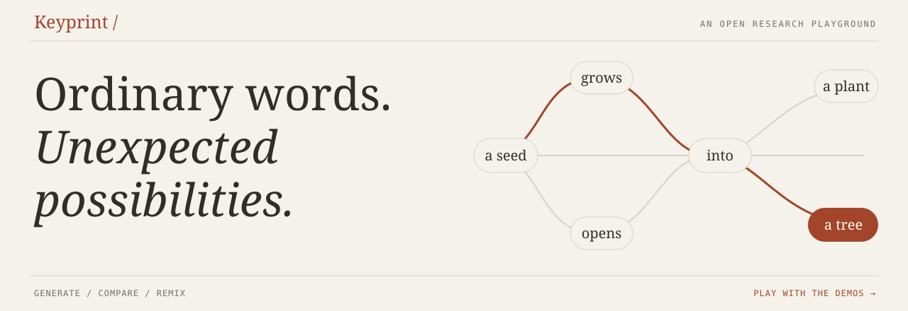
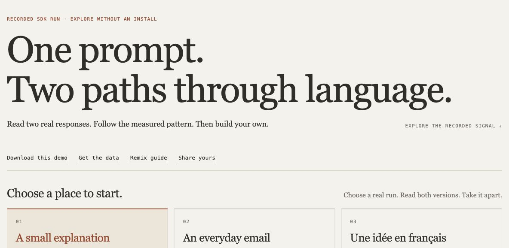

<p align="center">
  <a href="https://keyprint.vercel.app/play/"></a>
</p>
<p align="center">
  <a href="https://keyprint.vercel.app/play/"><strong>Play now</strong></a> ·
  <a href="#start-here">Install</a> ·
  <a href="demos/README.md">Remix a demo</a> ·
  <a href="USAGE.md">API &amp; guide</a> ·
  <a href="docs/INFERENCE_PROVIDERS.md">Inference providers</a> ·
  <a href="https://github.com/Cveinnt/keyprint/discussions">Community</a>
</p>
<p align="center">
  <a href="https://github.com/Cveinnt/keyprint/releases/tag/v0.1.0a1"></a>
  <a href="LICENSE"></a>
  <a href="#start-here"></a>
  <a href="https://keyprint.vercel.app/play/"></a>
</p>

Keyprint makes text watermarking something you can take apart. Generate two responses,
compare their exact wording, replay the model's tokens, and turn the same data into your own demo.

**Open research preview.** Real outputs, visible failures, MIT code. Reliable detection
and negligible quality impact remain open. [What works and what is open →](ROADMAP.md)
[Launch status and remaining clue gaps →](docs/LAUNCH_STATUS.md)

## Start playing

**[Open the recorded playground →](https://keyprint.vercel.app/play/)**
No account, installation, API key or model download. Three real local-model runs are ready immediately.

[](https://keyprint.vercel.app/play/)

| Pick an experiment | What you can do |
| --- | --- |
| [One prompt, two responses](https://keyprint.vercel.app/play/?example=0#outputs) | Compare wording, switch reading modes and inspect the original text. |
| [Inside the token stream](https://keyprint.vercel.app/play/?example=2#choices) | Replay a French response token by token; inspect IDs, bytes and character boundaries. |
| [Follow the signal](https://keyprint.vercel.app/play/?example=0#explore) | Scrub measured prefixes; compare keyed and control observations. |
| [An email that gets details wrong](https://keyprint.vercel.app/play/?example=1#outputs) | See the retained constraint failure. Explore the limits alongside the mechanism. |
| [Try your own words](https://keyprint.vercel.app/#experiment) | Edit a sentence in the browser's supplied-choice teaching illustration. |
| [144 recorded comparisons](https://keyprint.vercel.app/quality-comparisons.html) | Explore math, reading and instruction-following outputs, including failures. |

The gallery replays real recordings; it does not run new inference in your browser.
Edit a prompt to get matching Python code. New generations and arbitrary text inspection
run in the local SDK. The separate word-choice illustration is a teaching model.
Signal values are diagnostic observations, **not detection confidence**.

## A small API. Your own presentation.

```python
from keyprint import Keyprint

with Keyprint.from_mlx("path/to/qwen3-8b-4bit", key=Keyprint.new_key()) as wm:
    pair = wm.compare("In two sentences, explain how a seed becomes a tree.")
    print(pair.ordinary)
    print(pair.marked)
    pair.export("my-demo")
```

Serve `my-demo` with `python -m http.server --directory my-demo`.
You get the same recorded viewer as the live playground, with exact text, token traces
and prefix measurements. No frontend build step. No model needed for playback.

Use `pair.to_dict()` to build your own visualization. Optional `from_transformers`
and `from_llama_cpp` constructors use the same comparison API within their supported scope.

| Make it yours | Starting point |
| --- | --- |
| A standalone comparison | [`compare_live.py`](examples/compare_live.py) |
| A collection of prompts | [`gallery.py`](examples/gallery.py) + `export_gallery(...)` |
| A custom signal visualization | [`prefix_signal.py`](examples/prefix_signal.py) + [public recording](demos/recordings/replay.json) |
| A model comparison | [`compare_models.py`](examples/compare_models.py), with sequential model loading |
| A browser-only remix | [Download the complete demo](https://keyprint.vercel.app/play/keyprint-demo.zip) or [run from source](demos/README.md) |

## Start here

Use Python 3.12 or 3.13. `keyprint` is the package and command name.
This preview installs from its tagged GitHub source or a prebuilt release wheel;
**it is not on PyPI yet**.

```sh
python -m venv .venv
source .venv/bin/activate
python -m pip install 'keyprint[playground] @ git+https://github.com/Cveinnt/keyprint.git@v0.1.0a1'
keyprint playground --download
```

On Windows, activate with `.venv\Scripts\Activate.ps1` in PowerShell.
Open the local session URL printed by the command. Enter a prompt, generate both
responses and inspect the results. No hosted API key is needed.

`--download` explicitly fetches pinned weights: about **4.62 GB** for Qwen/MLX on
Apple Silicon, or **270 MB** for the small SmolLM2 CPU fixture elsewhere. Dependencies
and inference RAM are additional. The CPU fixture has limited answer quality.
Later runs use `keyprint playground` without downloading again.
[Existing models, setup checks and backend options →](USAGE.md#the-interactive-playground)

**No Git installed?** [Download the prebuilt wheel](https://github.com/Cveinnt/keyprint/releases/download/v0.1.0a1/keyprint-0.1.0a1-py3-none-any.whl),
then run these commands in the activated environment from the download directory:

```sh
python -m pip install './keyprint-0.1.0a1-py3-none-any.whl[playground]'
keyprint doctor
keyprint playground --download
```

The [release](https://github.com/Cveinnt/keyprint/releases/tag/v0.1.0a1) includes
SHA-256 checksums and build provenance. The wheel is built from the unchanged
release tag; the same backend dependencies and explicit model download apply.

**Just exploring the frontend?** Clone this repo and run `python tools/serve_demos.py`.
It serves the recordings using Python's standard library. No SDK dependencies or weights.

## Where it fits

**Running an inference service? [Start with the provider quickstart](docs/INFERENCE_PROVIDERS.md)**
for a local client request, native integration paths and the exact qualification gaps.

Keyprint operates during generation in supported **local model runtimes**.
MLX, Transformers and llama.cpp paths have scoped evidence; native vLLM/SGLang pilots
remain experimental. OpenAI, Anthropic, Ollama, LangChain and routing clients can use
specific local protocol paths. This does **not** add watermarking to hosted GPT or Claude.

[Compatibility matrix](COMPATIBILITY.md) · [Provider recipes](PROVIDERS.md) ·
[Actual inference evidence](INFERENCE_TESTING.md) · [Resource safety](MEMORY_SAFETY.md)

Existing documents are never silently rewritten or translated to add a mark.
Generated text can still contain factual errors. Keyprint is not a production
attribution detector or a verified reconstruction of Anthropic's private algorithm.
The [research roadmap](ROADMAP.md) keeps these questions open and inspectable.

## Build with us

A good contribution can be one beautiful demo, one reproducible failure or one better experiment.

- **[Share a demo](https://github.com/Cveinnt/keyprint/discussions/categories/show-and-tell)** with its original outputs and a runnable recipe.
- **[Pick a starter issue](https://github.com/Cveinnt/keyprint/issues)** for demos, multilingual fixtures, installation or detection research.
- **[Bring your coding agent](AGENTS.md)**. Give it one bounded issue; review its patch and reported checks. [`llms.txt`](llms.txt) indexes the docs.
- **[Contribute code](CONTRIBUTING.md)** or [ask a question](https://github.com/Cveinnt/keyprint/discussions).

Built by **Vincent Wu (Cveinnt)**. [MIT](LICENSE); [third-party notices](sdk/THIRD_PARTY_NOTICES.md).
